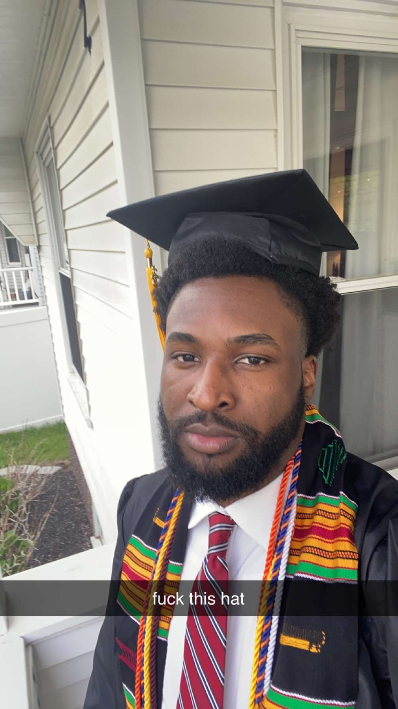

After recently graduating from [Salem State University](https://www.salemstate.edu/) with a major in computer science and a double minor in math and physics (here's a picture)

and yes i hated the hat cause it clearly didnt fit. It is finally time to take on what ive been hiding from, moving out my moms basement. On a more serious note graduating was really exciting, college always felt like a burden on my back and this annoying thing i have to do to be successful in life. While doing it, i came to a realization that it wasnt the case. No matter what route you decided to take in life, you need only two things to be 'very' successful, hardwork and consistency (as long as it is legal of course).

# Next Steps

I was able to land a role as a Cloud engineer at a very exciting company, apart from my love of SWE and the cloud, i preferred this role over a traditional new grad software engineering position for 2 main reasons:

- Compensation
- The team

I think my first reason is self explanatory and one can alude to the reason/s why.
The second reason not so much. After completing a ~8 month SWE internship with the engineering team, i loved the work environment, ethic and mindset.
I had the opportunity of working with really smart people with tons of experience meaning more was expected out of me. This motivated me to work (grind) even harder.
I was also  incharge of all technical decisions on anything i built which is always a good thing.
These metrics all played a crucial role in me signing a full time offer

With all of that being said, i have a hard career goal of becoming a millionaire my 25 (currently 21 with $300 in my bank account) and the way i plan on doing this is through entrepreneurship in the tech space (startups, saas etc). So for the next few years i will be locked in my room working towards that goal along my daytime job.
